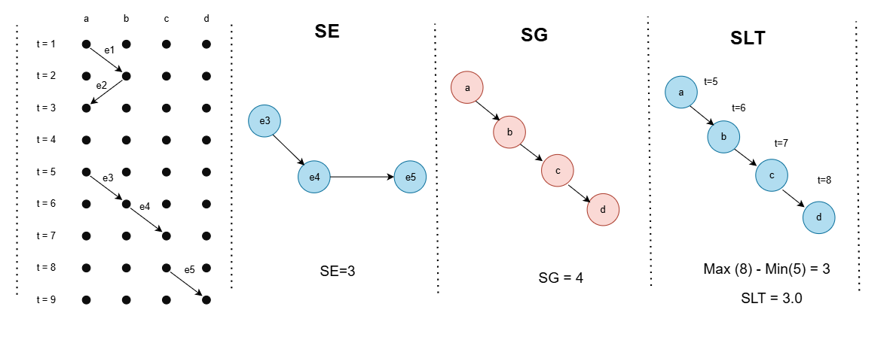

# Temporal Percolation Analysis

## Overview

This project provides a simple and effective way to analyze percolation transitions in temporal networks, focusing on three primary components:

1. **Event-Based Percolation (SE)**: Measures the number of event-graph nodes in the largest connected component.
2. **Node-Based Percolation (SG)**: Counts the number of unique temporal network nodes covered by the component.
3. **Lifetime-Based Percolation (SLT)**: Calculates the duration from the earliest to the latest event within a connected component.

This method is applied to real-world datasets from Wikipedia, Reddit, and UCI to analyze phase transitions. The project provides users to identify percolation behavior efficiently, which can be useful in fields such as information diffusion, epidemic modeling, and network robustness.

For a deeper understanding of percolation in temporal networks, refer to the foundational work on weighted event graphs by Mikko Kivelä et al. [(link)](https://doi.org/10.48550/arXiv.1709.05647).

## Features

- **Temporal Graph Processing**: Constructs event graphs from temporal edge lists using [pathpyG](https://www.pathpy.net/).
- **Connected Components Analysis**: Identifies connected components in event graphs using pathpyG's built-in algorithms.
- **Percolation Metrics Computation**: Computes event-graph node sizes, underlying graph nodes, and component lifetimes.
- **Critical Threshold Detection**: Determines percolation phase transitions.
- **Data Visualization**: Generates plots for component measures, percolation metrics, and probability distributions.

## Installation

Ensure you have the required dependencies installed:

```bash
pip install numpy pandas matplotlib seaborn torch pathpyG itertools
```

## Usage

### 1. Preprocess Data

```python
file_path = "wikipedia.csv"
bipartite = True

df  = preprocess(file_path)

# Normalize timestamps
df['normalized_ts'] = (df['ts'] - df['ts'].min()) 
tedges = list(df[['u', 'i', 'normalized_ts']].itertuples(index=False, name=None))

# Construct Temporal Graph
temporal_graph = pp.TemporalGraph.from_edge_list(tedges)
total_events = len(tedges)
```

### 2. Perform Percolation Analysis

```python
bipartite_percolation = TemporalPercolation(temporal_graph, total_events)

delta_t_values = np.linspace(df['normalized_ts'].min(), df['normalized_ts'].max(), 200)
analysis_results, percolation_metrics = bipartite_percolation.percolation_analysis(delta_t_values)
```

### 3. Visualize Results

```python
bipartite_percolation.compare_component_measures(analysis_results)
bipartite_percolation.plot_largest_component(analysis_results, delta_t_values)
```

### 4. Compute Order Parameters

```python
delta_t_values, rho_E, rho_G, rho_LT, chi_E, chi_G, chi_LT, P_S_E_distributions, P_S_LT_distributions, P_S_G_distributions = bipartite_percolation.compute_order_parameters(analysis_results, temporal_graph)
```

### 5. Plot Percolation Metrics

```python
rho_metrics = [rho_E, rho_G, rho_LT]
chi_metrics = [chi_E, chi_G, chi_LT]
labels = [(r'$ρ_E$', r'$χ_E$'), (r'$ρ_G$', r'$χ_G$'), (r'$ρ_{LT}$', r'$χ_{LT}$')]
colors = ('red', 'blue')

bipartite_percolation.plot_percolation_metrics(delta_t_values, rho_metrics, chi_metrics, labels, colors, time_range=100)
```

### 6. Compute Probability Distributions

```python
selected_delta_t_values = [3.6, 7.2, 25.2]
for dt in selected_delta_t_values:
    if dt in P_S_E_distributions:
        sizes = np.array(list(P_S_E_distributions[dt].keys()))
        probabilities = np.array(list(P_S_E_distributions[dt].values()))
        plt.scatter(sizes, probabilities, label=f'$\delta t$ = {dt:.1f} hours')
plt.xscale("log")
plt.yscale("log")
plt.xlabel("$S_E$")
plt.ylabel("$P(S_E)$")
plt.legend()
plt.show()
```

## Temporal Percolation Measures

To better illustrate the different percolation measures used in this analysis, the following diagram visualizes key component metrics:




- **LCC (Largest Connected Component)**: The primary connected structure in the event graph.
- **SE (Event Graph Nodes)**: Number of event-graph nodes in the largest connected component.
- **SG (Underlying Graph Nodes)**: Number of distinct temporal network nodes covered by the component.
- **SLT (Component Lifetime)**: Difference between the maximum and minimum timestamps of the events in the component.


## Citation
The methodology follows the approach introduced by:
```
@article{kivela2018mapping,
  title={Mapping temporal-network percolation to weighted, static event graphs},
  author={Kivel{\"a}, Mikko and Cambe, Jordan and Saram{\"a}ki, Jari and Karsai, M{\'a}rton},
  journal={Scientific reports},
  volume={8},
  number={1},
  pages={12357},
  year={2018},
  publisher={Nature Publishing Group UK London}
}
```


